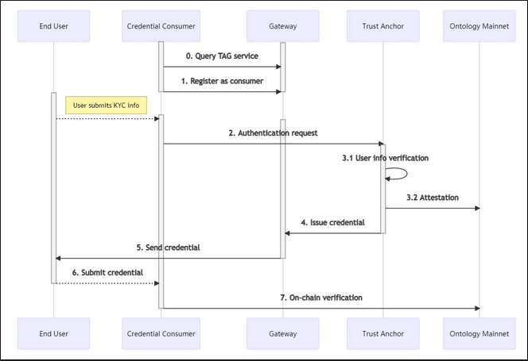

<h1 align="center"> KYC using Verifiable Credentials </h1>

# Overview

The trust anchor KYC system takes user data from your platform, authenticates it with a third party verifying institution such as Shufti Pro or Identity Mind, and issues credentials for the user that are valid for a certain period of time.

A credential contains all the verified data passed with the authentication request. Ideally, the user would store their credential and authorize access to credential data as necessary.

This data can be used to perform background checks and assess any associated risks.

The overall KYC verification degree can be customized to your app logic and business needs.

# Process Flow

The ONT ID framework can be used to assign DIDs to entities in networks. Once an identifier has been assigned, a process that takes place off-chain, the entity can start making specific claims. Validation and verification of these claims will be a part of most operations associated with this particular entity.

The set of claims are first validated by a reliable institution (a trust anchor), and then packaged into a credential (JWT). This credential is to be stored for later use while it’s still valid. Generally speaking, the credential is sent to the user and they are prompted to store and maintain it.

Upon being validated, a record of this action will be registered on the Ontology chain. This record contains details such as when it will expire and a hash which is used to verify if the credential data has been tampered with.

The following sequence diagram illustrates the flow of data between different parties.

- **End user:** The user makes the claim (by providing personal details). May be termed as the credential owner.
- **Credential consumer:** The system or the institution that will process (or consume) the credentials presented by the end user.
- **Trust Anchor Gateway:** Intermediary service used to avail trust anchor services, register credential consumers and obtain credentials.
- **Trust Anchor:** The system that validates the KYC/AML information submitted by users. Consists of a third-party verifying institution, e.g., Identity Mind, Shufti Pro, etc. Issues credentials after successful verification.
- **Ontology Mainnet:** The Ontology blockchain.

# Integrating and Using the SDK

The steps have been laid out below and described individually in the later section.

1. Register as a credential consumer to obtain the SDK configuration file
2. Verify the KYC details submitted by the user by calling the SDK to send authentication requests
3. Use a wallet to get the user to authorize access to their credential data after they have stored it

## Registration

1. Download and install the Ontology Authenticator or ONTO wallet application on your mobile device, and then create or import an ONT ID wallet account. This ONT ID will be later used as the credentials consumer ID

**Note:** You can get in touch with the Ontology team to connect a wallet that pays the gas fee on your behalf for on-chain operations.

2. Share this wallet address with Ontology to obtain the SDK configuration file that contains information necessary to invoke the gateway service, including the API key.

## KYC Operations

The KYC information verification process is followed by issuing a credential. This credential can serve as the proof of identity for the user till it expires. The process is mentioned below.

**Note:** ONT IDs do not need to be generated separately. The existing public key of the wallet address is prefixed with the method name, for instance _**did:bnb:1f4B9...766De**_. Refer to the method specifications for [Ethereum](https://docs.ont.io/decentralized-identity-and-data/ontid/etho-id/method-specification), [Binanace Smart Chain](https://docs.ont.io/decentralized-identity-and-data/ontid/binance-id/method-specification), and [Ontology](https://docs.ont.io/decentralized-identity-and-data/ontid/ont-id/specification) for more details on how this works.

1. First, take the user’s wallet address to form an ONT ID.
2. The next step is to verify the KYC data collected from the user. Based on the result, the trust anchor server will issue a verifiable credential.
3. Upon authorization from the user, different applications and platforms can process credential data in different ways.

**Note:** Some trust anchors may not support continued re-use of credentials.

## Data Verification

The user KYC data verification logic is as defined below:

1. The user enters their KYC information and submits it for verification. As per the KYC needs of the usage scenario, you can get in touch with our team to enable facial biometric and other modes of verification etc.
2. You send this data with an authentication request via the gateway using the TS SDK.
3. The trust anchor verifies this data and returns a result. If the KYC data is valid, it issues a credential, records its status on-chain, and sends it back to the gateway.
4. You can now use the TS SDK to fetch this credential and prompt the user to store it on their device.
5. You send a request to the user to authorize access to their credential data.
6. Next, you can use the Ontology SDK to process the credential data as and when shared by the user. The credential status can be verified on-chain as per app logic.

# Wallet Support

The credentials issued by the trust anchor verification server can be linked to ONT ID on multiple chains with different wallets. This is achieved by using the user’s wallet address (public key).

For this logic to work, the system should be compatible with the decentralized approach of identity and credential handling, which is to say that the wallet and the credential data can be under the user’s control, and it should be possible for the client to store credentials on their device. The data request process looks something like:

1. The user stores the encrypted credential
2. Once the user signs and authorizes the action using their private key, this action is recorded on-chain.
3. This credential data can now be accessed and processed.

You can use the Java SDK to process credentials and make on-chain verifications. This can be implemented with any third party wallet client that supports signing.

Ontology's Chrome extension wallet Cyano, and mobile data wallet **ONTO** support credential management out of the box.

# Pricing

The fee structure for the verification service is listed below. In case of any queries, please get in touch with the Ontology team directly here.

|                      Operation                      |   Fee    |                Remarks                 |
| :-------------------------------------------------: | :------: | :------------------------------------: |
|          Registering a credential consumer          | 100 ONG  |       Support on-behalf coverage       |
|        Per KYC verification transaction gas         | 0.05 ONG |       Support on-behalf coverage       |
|       Per wallet verification transaction gas       | 0.05 ONG |       Support on-behalf coverage       |
| Third-party trust anchor institution authentication | 2.4 USD  | Negotiable based on transaction volume |
